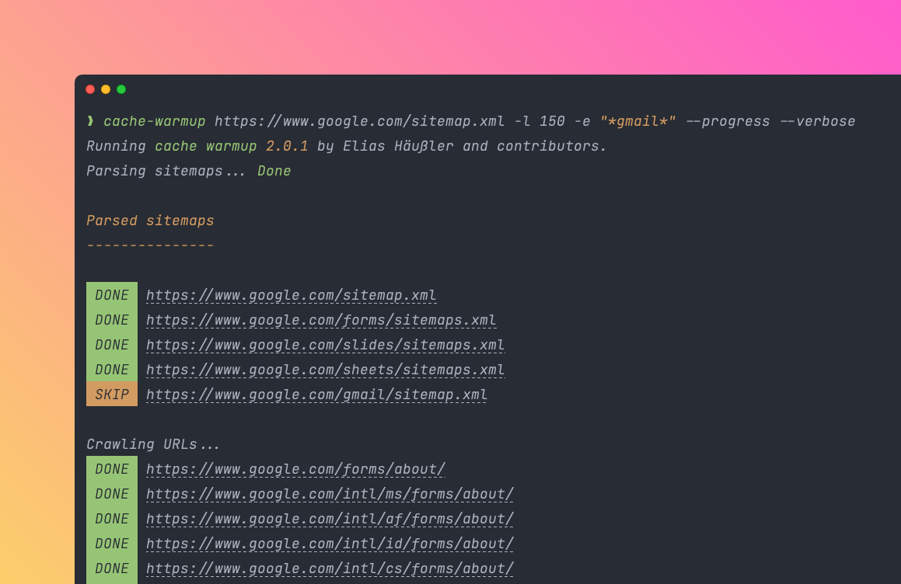

<div align="center">

[](https://cache-warmup.dev/)

# Cache Warmup

[](https://coveralls.io/github/eliashaeussler/cache-warmup)
[](https://codeclimate.com/github/eliashaeussler/cache-warmup/maintainability)
[](https://github.com/eliashaeussler/cache-warmup/actions/workflows/cgl.yaml)
[](https://github.com/eliashaeussler/cache-warmup/actions/workflows/tests.yaml)
[](https://packagist.org/packages/eliashaeussler/cache-warmup)

</div>

A library to warm up website caches of URLs located in XML sitemaps. It is
written in PHP and was first released back in 2020.

Cache warmup is performed by concurrently sending simple HEAD requests to those
URLs, either from the command line or by using the provided PHP API. The whole
warmup process is highly customizable, e.g. by defining a crawling limit,
excluding sitemaps and URLs by exclusion patterns or by using a specific crawling
strategy. It is even possible to write custom crawlers that take care of cache warmup.

## 🚀 Features

* Warm up caches of URLs located in XML sitemaps
* Console command and PHP API for cache warmup
* Out-of-the-box support for sitemap indexes
* Exclusion patterns for sitemaps and URLs
* Various crawling strategies to modify crawling behavior
* Support for gzipped XML sitemaps
* Interface for custom crawler implementations

## 🔥 Quickstart

```bash
# Download latest release
curl -LO https://github.com/eliashaeussler/cache-warmup/releases/latest/download/cache-warmup.phar
chmod +x cache-warmup.phar

# Run cache warmup
./cache-warmup.phar "https://www.example.com/sitemap.xml"
```

Find more [installation methods](https://cache-warmup.dev/installation.html)
in the official documentation.

## 📕 Documentation

Find all available installation methods, configuration options and customization
opportunities in the [official documentation](https://cache-warmup.dev/).

## 🧑‍💻 Contributing

Please have a look at [`CONTRIBUTING.md`](CONTRIBUTING.md).

## ⭐ License

This project is licensed under [GNU General Public License 3.0 (or later)](LICENSE.md).
