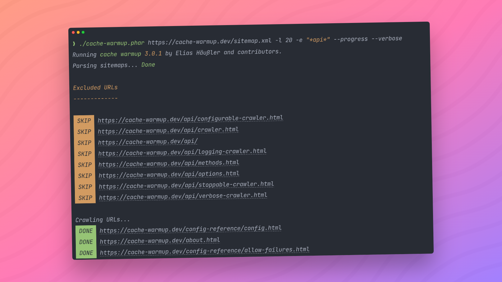

<div align="center">

[](https://cache-warmup.dev/)

[](https://github.com/eliashaeussler/cache-warmup/releases)
[](https://hub.docker.com/r/eliashaeussler/cache-warmup)
[](https://packagist.org/packages/eliashaeussler/cache-warmup)
[](LICENSE.md)

# Sitemap Crawler & Cache Warmer

A PHP library to warm up website caches of URLs located in XML sitemaps.

[**Explore the docs &raquo;**](https://cache-warmup.dev/)

[Report Bug](https://github.com/eliashaeussler/cache-warmup/issues/new?template=bug_report.yml&title=%5BBUG%5D) &middot;
[Request Feature](https://github.com/eliashaeussler/cache-warmup/issues/new?template=feature_request.yml&title=%5BFEATURE%5D) &middot;
[Join Discussions](https://github.com/eliashaeussler/cache-warmup/discussions) &middot;
[Latest Release](https://github.com/eliashaeussler/cache-warmup/releases/latest) &middot;
[Sponsor](https://cache-warmup.dev/sponsor.html)

</div>

## ✨ Features

* Warm up caches of URLs located in XML sitemaps
* Console command and PHP API for cache warmup
* Out-of-the-box support for sitemap indexes
* Exclusion patterns for sitemaps and URLs
* Various crawling strategies to modify crawling behavior
* Support for gzipped XML sitemaps
* Interface for custom crawler implementations

## 🚀 Getting Started

```bash
# Download latest release
curl -LO https://github.com/eliashaeussler/cache-warmup/releases/latest/download/cache-warmup.phar
chmod +x cache-warmup.phar

# Run cache warmup
./cache-warmup.phar "https://www.example.com/sitemap.xml"
```

Find more [installation methods](https://cache-warmup.dev/installation.html)
in the official documentation.

## 📕 Documentation

Find all available installation methods, configuration options and customization
opportunities in the [official documentation](https://cache-warmup.dev/).

## 🧑‍💻 Contributing

Please have a look at [`CONTRIBUTING.md`](CONTRIBUTING.md).

## ⭐ License

This project is licensed under [GNU General Public License 3.0 (or later)](LICENSE.md).
