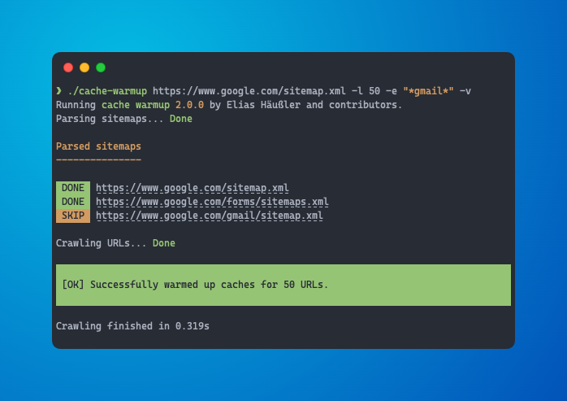

<div align="center">

[](#-installation)

# Cache warmup

[](https://codecov.io/gh/eliashaeussler/cache-warmup)
[](https://codeclimate.com/github/eliashaeussler/cache-warmup/maintainability)
[](https://github.com/eliashaeussler/cache-warmup/actions/workflows/cgl.yaml)
[](https://github.com/eliashaeussler/cache-warmup/actions/workflows/tests.yaml)
[](https://packagist.org/packages/eliashaeussler/cache-warmup)

</div>

A PHP library to warm up caches of URLs located in XML sitemaps. Cache warmup
is performed by concurrently sending simple `HEAD` requests to those URLs,
either from the command-line or by using the provided PHP API. The whole warmup
process is highly customizable, e.g. by defining a crawling limit, excluding
sitemaps and URLs by exclusion patterns or by using a specific crawling strategy.
It is even possible to write custom crawlers that take care of cache warmup.

## 🚀 Features

* Warm up caches of URLs located in XML sitemaps
* Console command and PHP API for cache warmup
* Support for sitemap indexes
* Exclusion patterns for sitemaps and URLs
* Various crawling strategies
* Support for gzipped XML sitemaps
* Interface for custom crawler implementations

## 🔥 Installation

### PHAR (recommended)

[](https://github.com/eliashaeussler/cache-warmup/releases)
[](https://github.com/eliashaeussler/cache-warmup/releases)

Head over to the [latest GitHub release][20] and download the [`cache-warmup.phar`][1] file.

Run `chmod +x cache-warmup.phar` to make it executable.

### PHIVE

[](https://phar.io)

```bash
phive install cache-warmup
```

### Docker

[](https://hub.docker.com/r/eliashaeussler/cache-warmup)
[](https://hub.docker.com/r/eliashaeussler/cache-warmup)

```bash
docker run --rm -it eliashaeussler/cache-warmup
```

You can also use the image from [GitHub Container Registry][21]:

```bash
docker run --rm -it ghcr.io/eliashaeussler/cache-warmup
```

### Composer

[](https://packagist.org/packages/eliashaeussler/cache-warmup)
[](https://packagist.org/packages/eliashaeussler/cache-warmup)

```bash
composer require eliashaeussler/cache-warmup
```

## ⚡ Usage

### Command-line usage

```bash
$ cache-warmup [options] [<sitemaps>...]
```

The following input parameters are available:

| Input parameter                                 | Description                                                            |
|-------------------------------------------------|------------------------------------------------------------------------|
| [`sitemaps`](#sitemaps)                         | URLs or local filenames of XML sitemaps to be warmed up                |
| [`--allow-failures`](#--allow-failures)         | Allow failures during URL crawling and exit with zero                  |
| [`--crawler-options`, `-o`](#--crawler-options) | JSON-encoded string of additional config for configurable crawlers     |
| [`--crawler`, `-c`](#--crawler)                 | FQCN of the crawler to use for cache warmup                            |
| [`--exclude`, `-e`](#--exclude)                 | Patterns of URLs to be excluded from cache warmup                      |
| [`--format`, `-f`](#--format)                   | Formatter used to print the cache warmup result                        |
| [`--limit`, `-l`](#--limit)                     | Limit the number of URLs to be processed                               |
| [`--log-file`](#--log-file)                     | File where to log crawling results                                     |
| [`--log-level`](#--log-level)                   | Log level used to determine which crawling results to log              |
| [`--progress`, `-p`](#--progress)               | Show a progress bar during cache warmup                                |
| [`--repeat-after`](#--repeat-after)             | Run cache warmup in endless loop and repeat *x* seconds after each run |
| [`--stop-on-failure`](#--stop-on-failure)       | Cancel further cache warmup requests on failure                        |
| [`--strategy`, `-s`](#--strategy)               | Optional crawling strategy to prepare URLs before crawling them        |
| [`--urls`, `-u`](#--urls)                       | Additional URLs to be warmed up                                        |

💡 Run `cache-warmup --help` to see a detailed explanation of all available
input parameters.

#### `sitemaps`

URLs or local filenames of XML sitemaps to be warmed up.

```bash
$ cache-warmup "https://www.example.org/sitemap.xml" "/var/www/html/sitemap.xml"
```

| Shorthand               | –                                                                            |
|:------------------------|:-----------------------------------------------------------------------------|
| Required                | ✅ *(either [`sitemaps`](#sitemaps) or [`--urls`](#--urls) must be provided)* |
| Multiple values allowed | ✅                                                                            |
| Default                 | **–**                                                                        |

#### `--urls`

Additional URLs to be warmed up.

```bash
$ cache-warmup -u "https://www.example.org/" -u "https://www.example.org/de/"
```

| Shorthand               | `-u`                                                                         |
|:------------------------|:-----------------------------------------------------------------------------|
| Required                | ✅ *(either [`sitemaps`](#sitemaps) or [`--urls`](#--urls) must be provided)* |
| Multiple values allowed | ✅                                                                            |
| Default                 | **–**                                                                        |

#### `--exclude`

Patterns of URLs to be excluded from cache warmup.

The following patterns can be configured:

* Regular expressions with delimiter `#`, e.g. `#(no_cache|no_warming)=1#`
* Patterns for use with [`fnmatch`][2], e.g. `*no_cache=1*`

```bash
$ cache-warmup -e "#(no_cache|no_warming)=1#" -e "*no_cache=1*"
```

| Shorthand               | `-e`  |
|:------------------------|:------|
| Required                | **–** |
| Multiple values allowed | ✅     |
| Default                 | **–** |

#### `--limit`

Limit the number of URLs to be processed.

```bash
$ cache-warmup --limit 250
```

| Shorthand               | `-l`                 |
|:------------------------|:---------------------|
| Required                | **–**                |
| Multiple values allowed | **–**                |
| Default                 | **0** *(= no limit)* |

#### `--progress`

Show a progress bar during cache warmup.

> [!NOTE]
> You can show a more verbose progress bar by increasing output verbosity
> with the `--verbose` command option.

> [!IMPORTANT]
> The progress bar is implicitly enabled when using a non-verbose
> [formatter](#--format), e.g. `json`.

```bash
$ cache-warmup --progress
```

| Shorthand               | `-p`   |
|:------------------------|:-------|
| Required                | **–**  |
| Multiple values allowed | **–**  |
| Default                 | **no** |

#### `--crawler`

FQCN of the crawler to use for cache warmup.

The crawler must implement one the following interfaces:

* [`EliasHaeussler\CacheWarmup\Crawler\CrawlerInterface`][3] represents a basic
  crawler and must always be implemented (the following interfaces extend this
  interface).
* [`EliasHaeussler\CacheWarmup\Crawler\VerboseCrawlerInterface`][4] receives the
  current console output to generate user-oriented output.

In addition, there exist more interfaces with advanced crawling features:

* [`EliasHaeussler\CacheWarmup\Crawler\ConfigurableCrawlerInterface`][5] allows to
  make crawlers configurable (see [`--crawler-options`](#--crawler-options)).
* [`EliasHaeussler\CacheWarmup\Crawler\LoggingCrawlerInterface`][24] can be used
  to implement logging of crawling results (see [`--log-file`](#--log-file) and
  [`--log-level`](#--log-level)).
* [`EliasHaeussler\CacheWarmup\Crawler\StoppableCrawlerInterface`][23] prematurely
  cancels cache warmup if a crawling fails (see [`--stop-on-failure`](#--stop-on-failure)).

```bash
$ cache-warmup --crawler "Vendor\Crawler\MyCustomCrawler"
```

| Shorthand               | `-c`               |
|:------------------------|:-------------------|
| Required                | **–**              |
| Multiple values allowed | **–**              |
| Default                 | **–**<sup>1)</sup> |

*<sup>1)</sup> The default crawler depends on whether the command option
[`--progress`](#--progress) is set. In this case the [`OutputtingCrawler`][6]
is used, otherwise the [`ConcurrentCrawler`][7].*

#### `--crawler-options`

A JSON-encoded string of additional config for configurable crawlers.

> [!IMPORTANT]
> These options only apply to crawlers implementing
> [`EliasHaeussler\CacheWarmup\Crawler\ConfigurableCrawlerInterface`][5]. If the
> configured crawler does not implement this interface, a warning is shown in case
> crawler options are configured.

```bash
$ cache-warmup --crawler-options '{"concurrency": 3, "request_options": {"delay": 3000}}'
```

| Shorthand               | `-o`       |
|:------------------------|:-----------|
| Required                | **–**      |
| Multiple values allowed | **–**      |
| Default                 | **`null`** |

#### `--strategy`

Optional crawling strategy to prepare URLs before crawling them.

The following strategies are currently available:

* [`sort-by-changefreq`][8]
* [`sort-by-lastmod`][9]
* [`sort-by-priority`][10]

```bash
$ cache-warmup --strategy sort-by-priority
```

| Shorthand               | `-s`                            |
|:------------------------|:--------------------------------|
| Required                | **–**                           |
| Multiple values allowed | **–**                           |
| Default                 | **–** *(= crawl by occurrence)* |

#### `--format`

The formatter used to print the cache warmup result.
Read more in the [Formatters](#formatters) section below.

At the moment, the following formatters are available:

* [`json`][11]
* [`text`][12] *(default)*

```bash
$ cache-warmup --format json
```

| Shorthand               | `-f`       |
|:------------------------|:-----------|
| Required                | ✅          |
| Multiple values allowed | **–**      |
| Default                 | **`text`** |

#### `--log-file`

A file where to log crawling results. Implicitly enables logging,
if this option is set.

```bash
$ cache-warmup --log-file cache-warmup.log
```

| Shorthand               | –     |
|:------------------------|:------|
| Required                | **–** |
| Multiple values allowed | **–** |
| Default                 | **–** |

#### `--log-level`

The log level used to determine which crawling results to log. This
option is only respected if the [`--log-file`](#--log-file) command
option is set.

The following log levels are available:

* `emergency`
* `alert`
* `critical`
* `error` (default; enables logging of failed crawls)
* `warning`
* `notice`
* `info` (enables logging of successful crawls)
* `debug`

```bash
$ cache-warmup --log-level error
```

| Shorthand               | –                                        |
|:------------------------|:-----------------------------------------|
| Required                | **–**                                    |
| Multiple values allowed | **–**                                    |
| Default                 | **`error`** *(= log only failed crawls)* |

#### `--allow-failures`

Allow failures during URL crawling and exit with zero.

```bash
$ cache-warmup --allow-failures
```

| Shorthand               | –      |
|:------------------------|:-------|
| Required                | **–**  |
| Multiple values allowed | **–**  |
| Default                 | **no** |

#### `--stop-on-failure`

Cancel further cache warmup requests on failure.

```bash
$ cache-warmup --stop-on-failure
```

| Shorthand               | –      |
|:------------------------|:-------|
| Required                | **–**  |
| Multiple values allowed | **–**  |
| Default                 | **no** |

#### `--repeat-after`

Run cache warmup in endless loop and repeat *x* seconds after each run.

```bash
$ cache-warmup --repeat-after 300
```

> [!IMPORTANT]
> If cache warmup fails, the command fails immediately and is not repeated.
> To continue in case of failures, the [`--allow-failures`](#--allow-failures)
> command option must be passed as well.

| Shorthand               | –                           |
|:------------------------|:----------------------------|
| Required                | **–**                       |
| Multiple values allowed | **–**                       |
| Default                 | **`0`** *(= run only once)* |

### Code usage

```php
// Instantiate and run cache warmer
$cacheWarmer = new \EliasHaeussler\CacheWarmup\CacheWarmer();
$cacheWarmer->addSitemaps('https://www.example.org/sitemap.xml');
$result = $cacheWarmer->run();

// Get successful and failed URLs
$successfulUrls = $result->getSuccessful();
$failedUrls = $result->getFailed();
```

## 📂 Configuration

### Crawler configuration

Both default crawlers are implemented as configurable crawlers:

* [`EliasHaeussler\CacheWarmup\Crawler\ConcurrentCrawler`][7]
* [`EliasHaeussler\CacheWarmup\Crawler\OutputtingCrawler`][6]

The following configuration can be passed either on command-line
as JSON-encoded string (see [`--crawler-options`](#--crawler-options)
command option) or as associative array in the constructor when
using the library with PHP.

#### `concurrency`

Define how many URLs are crawled concurrently.

> [!NOTE]
> Internally, Guzzle's [Pool][13] feature is used to send multiple requests
> concurrently using asynchronous requests. You may also have a look at how
> this is implemented in the library's [`RequestPoolFactory`][14].

```php
$crawler = new \EliasHaeussler\CacheWarmup\Crawler\ConcurrentCrawler([
    'concurrency' => 3,
]);
```

| Type    | `integer` |
|:--------|:----------|
| Default | **`5`**   |

#### `request_method`

The [HTTP method][15] used to perform cache warmup requests.

```php
$crawler = new \EliasHaeussler\CacheWarmup\Crawler\ConcurrentCrawler([
    'request_method' => 'GET',
]);
```

| Type    | `string`   |
|:--------|:-----------|
| Default | **`HEAD`** |

#### `request_headers`

A list of [HTTP headers][16] to send with each cache warmup request.

```php
$crawler = new \EliasHaeussler\CacheWarmup\Crawler\ConcurrentCrawler([
    'request_headers' => [
        'X-Foo' => 'bar',
        'User-Agent' => 'Foo-Crawler/1.0',
    ],
]);
```

| Type      | `array<string, string>`                                     |
|:----------|:------------------------------------------------------------|
| Mergeable | ✅                                                           |
| Default   | **`['User-Agent' => '<default user-agent>']`**<sup>2)</sup> |

*<sup>2)</sup>The default user-agent is built in [`ConcurrentCrawlerTrait::getRequestHeaders()`][17].*

#### `request_options`

Additional [request options][18] used for each cache warmup request.

```php
$crawler = new \EliasHaeussler\CacheWarmup\Crawler\ConcurrentCrawler([
    'request_options' => [
        'delay' => 500,
        'timeout' => 10,
    ],
]);
```

| Type      | `array<string, mixed>` |
|:----------|:-----------------------|
| Mergeable | **–**                  |
| Default   | **`[]`**               |

#### `client_config`

Optional [configuration][19] used when instantiating a new Guzzle client.

> [!IMPORTANT]
> Client configuration is ignored when running cache warmup from the
> command-line. In addition, it is only respected if a new client is
> instantiated *within* the crawler. If an existing client is passed to
> the crawler, client configuration is ignored.

```php
$stack = \GuzzleHttp\HandlerStack::create();
$stack->push($customMiddleware);

$crawlerConfig = [
    'client_config' => [
        'handler' => $stack,
    ],
];

// ✅ This works as expected
$crawler = new \EliasHaeussler\CacheWarmup\Crawler\ConcurrentCrawler(
    $crawlerConfig,
);

// ❌ This does *not* respect client configuration
$crawler = new \EliasHaeussler\CacheWarmup\Crawler\ConcurrentCrawler(
    $crawlerConfig,
    new \GuzzleHttp\Client(),
);
```

| Type      | `array<string, mixed>` |
|:----------|:-----------------------|
| Mergeable | **–**                  |
| Default   | **`[]`**               |

### Formatters

#### Text formatter

* Class name: [`EliasHaeussler\CacheWarmup\Formatter\TextFormatter`][12]
* Type: `text`

This is the default formatter that is used if no other formatter
is explicitly configured. It writes all user-oriented output to
the console.

#### JSON formatter

* Class name: [`EliasHaeussler\CacheWarmup\Formatter\JsonFormatter`][11]
* Type: `json`

This formatter can be used to format user-oriented output as JSON
object. It includes the following properties:

| Property            | Description                                                                                                            |
|---------------------|------------------------------------------------------------------------------------------------------------------------|
| `cacheWarmupResult` | Lists all crawled URLs, grouped by their crawling state (`failure`, `success`), and may contain `cancelled` state      |
| `messages`          | Contains all logged messages, grouped by message severity (`error`, `info`, `success`, `warning`)                      |
| `parserResult`      | Lists all parsed and excluded XML sitemaps and URLs, grouped by their parsing state (`excluded`, `failure`, `success`) |
| `time`              | Lists all tracked times during cache warmup (`crawl`, `parse`)                                                         |

💡 The complete JSON structure can be found in the provided [JSON schema][22].

## 🧑‍💻 Contributing

Please have a look at [`CONTRIBUTING.md`](CONTRIBUTING.md).

## ⭐ License

This project is licensed under [GNU General Public License 3.0 (or later)](LICENSE).

[1]: https://github.com/eliashaeussler/cache-warmup/releases/latest/download/cache-warmup.phar
[2]: https://www.php.net/manual/de/function.fnmatch.php
[3]: src/Crawler/CrawlerInterface.php
[4]: src/Crawler/VerboseCrawlerInterface.php
[5]: src/Crawler/ConfigurableCrawlerInterface.php
[6]: src/Crawler/OutputtingCrawler.php
[7]: src/Crawler/ConcurrentCrawler.php
[8]: src/Crawler/Strategy/SortByChangeFrequencyStrategy.php
[9]: src/Crawler/Strategy/SortByLastModificationDateStrategy.php
[10]: src/Crawler/Strategy/SortByPriorityStrategy.php
[11]: src/Formatter/JsonFormatter.php
[12]: src/Formatter/TextFormatter.php
[13]: https://docs.guzzlephp.org/en/stable/quickstart.html#concurrent-requests
[14]: src/Http/Message/RequestPoolFactory.php
[15]: https://docs.guzzlephp.org/en/stable/psr7.html#request-methods
[16]: https://docs.guzzlephp.org/en/stable/request-options.html#headers
[17]: src/Crawler/ConcurrentCrawlerTrait.php
[18]: https://docs.guzzlephp.org/en/stable/request-options.html
[19]: https://docs.guzzlephp.org/en/stable/quickstart.html#creating-a-client
[20]: https://github.com/eliashaeussler/cache-warmup/releases/latest
[21]: https://github.com/eliashaeussler/cache-warmup/pkgs/container/cache-warmup
[22]: res/cache-warmup-result.schema.json
[23]: src/Crawler/StoppableCrawlerInterface.php
[24]: src/Crawler/LoggingCrawlerInterface.php
