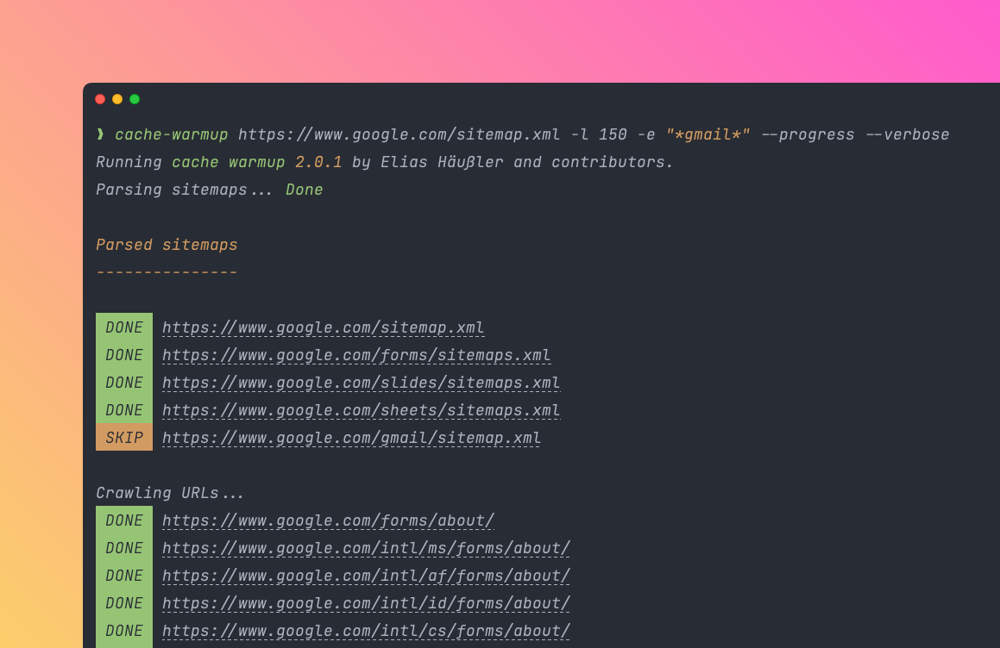

# About this project

*Cache Warmup* is a library to warm up website caches of URLs
located in XML sitemaps. It is written in PHP and was first published back in 2020.

Cache warmup is performed by concurrently sending simple `HEAD` requests to those
URLs, either from the [command line](installation.md) or by using the provided
[PHP API](api/index.md).

The whole warmup process is highly customizable, e.g. by defining a crawling limit,
excluding sitemaps and URLs by exclusion patterns or by using a specific crawling
strategy. It is even possible to write custom crawlers that take care of cache warmup.

## Features

::: info 🚀 XML sitemaps
Warm up caches of URLs located in [XML sitemaps](config-reference/sitemaps.md)
:::

::: info 🖥️ Console command
[Console command](installation.md) and [PHP API](api/index.md) for cache warmup
:::

::: info 🔀 Sitemap indexes
Out-of-the-box support for [sitemap indexes](https://www.sitemaps.org/protocol.html#index)
:::

::: info 🎯 Exclude patterns
[Exclusion patterns](config-reference/exclude.md) for sitemaps and URLs
:::

::: info 🧪 Crawling strategies
Various crawling [strategies](config-reference/strategy.md) to modify crawling behavior
:::

::: info 📦 `gzip` support
Support for gzipped XML sitemaps
:::

::: info 🧑‍💻 Customizable
Interface for [custom crawler](api/index.md#crawler) implementations
:::

… and [many more](config-reference/index.md)!
