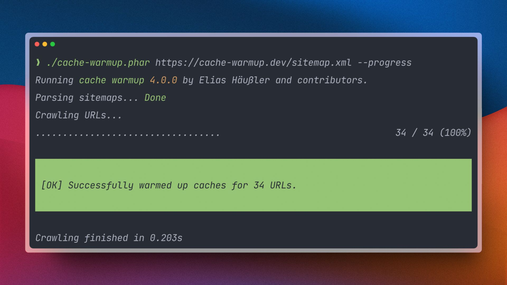
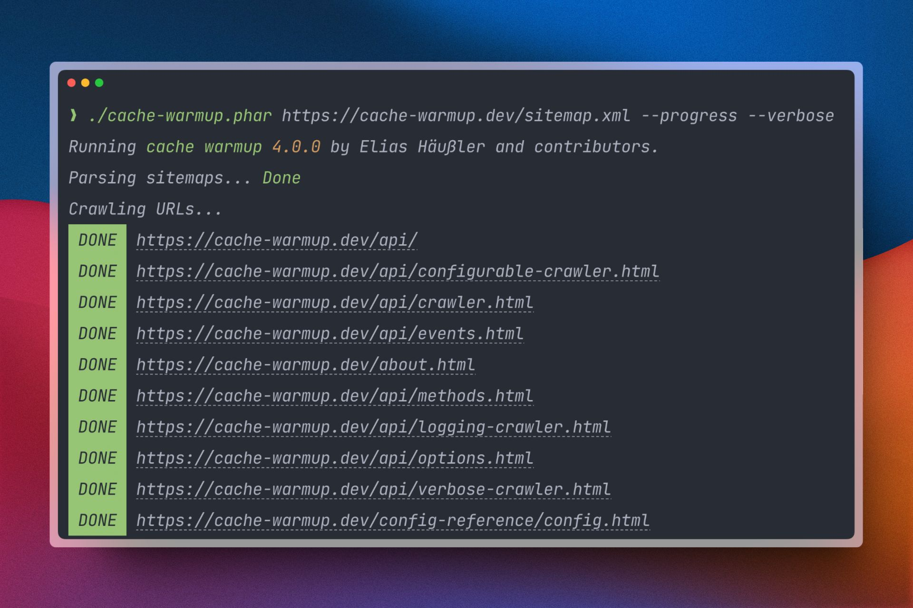

# Response Handlers

Crawlers use HTTP response handlers to evaluate crawling responses.
Each response handler implements the
[`Http\Message\Handler\ResponseHandler`](../../src/Http/Message/Handler/ResponseHandler.php)
interface.

## Method Reference

Each response handler must implement the following methods:

### `onSuccess`

Whenever a HTTP request is successful, this method is called.

```php
namespace Vendor\Http\Message\Handler;

use EliasHaeussler\CacheWarmup;
use Psr\Http\Message;

final class MyCustomHandler implements CacheWarmup\Http\Message\Handler\ResponseHandler
{
    public function onSuccess(
        Message\ResponseInterface $response,
        Message\UriInterface $uri,
    ): void {
        // ...
    }
}
```

### `onFailure`

When a HTTP request fails due to an error or exception, this
method is called.

```php
namespace Vendor\Http\Message\Handler;

use EliasHaeussler\CacheWarmup;
use Psr\Http\Message;
use Throwable;

final class MyCustomHandler implements CacheWarmup\Http\Message\Handler\ResponseHandler
{
    public function onFailure(
        Throwable $exception,
        Message\UriInterface $uri,
    ): void {
        // ...
    }
}
```

## Available handlers

The library already ships with a set of response handlers.

### `CompactProgressHandler`

The [`Http\Message\Handler\CompactProgressHandler`](../../src/Http/Message/Handler/CompactProgressHandler.php)
is used in the [`OutputtingCrawler`](../../src/Crawler/OutputtingCrawler.php) if
the [`progress`](../config-reference/progress.md) configuration option is enabled
and the `--verbose` command option is not set. It displays the cache warmup
progress in a compact progress style:



### `LogHandler`

When logging is enabled with the [`logFile`](../config-reference/log-file.md)
configuration option, the [`Http\Message\Handler\LogHandler`](../../src/Http/Message/Handler/LogHandler.php)
takes care of writing log file entries for each crawling response.

This handler is enabled in both default crawlers.

### `ResultCollectorHandler`

Each cache warmup process results in an instance of
[`Result\CacheWarmupResult`](../../src/Result/CacheWarmupResult.php). The
[`Http\Message\Handler\ResultCollectorHandler`](../../src/Http/Message/Handler/ResultCollectorHandler.php)
takes care of converting each crawling response to a dedicated
[`Result\CrawlingResult`](../../src/Result/CrawlingResult.php)
object and attaches it to the `CacheWarmupResult` object.

This handler is enabled in both default crawlers.

### `VerboseProgressHandler`

The [`Http\Message\Handler\VerboseProgressHandler`](../../src/Http/Message/Handler/VerboseProgressHandler.php)
is used in the [`OutputtingCrawler`](../../src/Crawler/OutputtingCrawler.php) if
the [`progress`](../config-reference/progress.md) configuration option is enabled,
along with the `--verbose` command option. It displays the cache warmup
progress in a more detailed verbose progress bar style:


